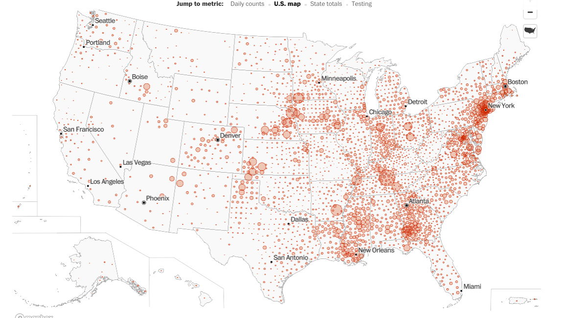

```{r setup, include=FALSE}
knitr::opts_chunk$set(echo = FALSE, warning=FALSE, message=FALSE, fig.height=6)
```

```{r, message=FALSE, warning=FALSE, include=FALSE}
library(CoV19)
library(ggplot2)
library(gridExtra)
```

This is off the WaPo page: https://www.washingtonpost.com/graphics/2020/national/coronavirus-us-cases-deaths/

Why does this look like this? Why is there so much white to the left?


```{r}
sworld <- subset(world, str_detect(region, "US") & date==max(date))
sworld$pop <- countypop$population[match(sworld$region, countypop$region)]
sworld$cases.per.100k <- sworld$positive/(sworld$pop/100000)
sworld$deaths.per.100k <- sworld$death/(sworld$pop/100000)
sworld$density <- countypop$density.sq.mi[match(sworld$region, countypop$region)]
sworld <- na.omit(sworld)
sworld$state <- state.name[unlist(sapply(sworld$region, function(x){max(which(str_detect(x, paste(state.name, "US"))))}))]
```

```{r}
dat <- sworld
dat$posclass <- cut(dat$positive, breaks=c(0,100,250,500,1000,5000,Inf))
dat$log.cases <- log(dat$cases.per.100k)
dat$log.death <- log(dat$deaths.per.100k)
dat$log.density <- log(dat$density)
dat <- na.omit(dat)
dat <- dat[!is.infinite(dat$log.cases),]
dat <- dat[!is.infinite(dat$log.death),]
ggplot(dat, aes(x=log.density, y=log.death)) + geom_point() + stat_smooth(method=lm) +
  facet_wrap(~posclass)
```

```{r}
ggplot(dat, aes(x=log.density, y=log.cases)) + geom_point() + stat_smooth(method=lm) +
  facet_wrap(~posclass)
```

```{r}
fit <- lm(log.cases ~ log.density, data=dat)
plot(dat$log.density, dat$log.cases,
             xlab="log density", ylab="log cases per 100k")
p <- predict(fit, interval="confidence", newdata=data.frame(log.density=seq(0,12,.1)))
lines(seq(0,12,.1), p[,1], col="red")
lines(seq(0,12,.1), p[,2], col="black")
lines(seq(0,12,.1), p[,3], col="black")

```